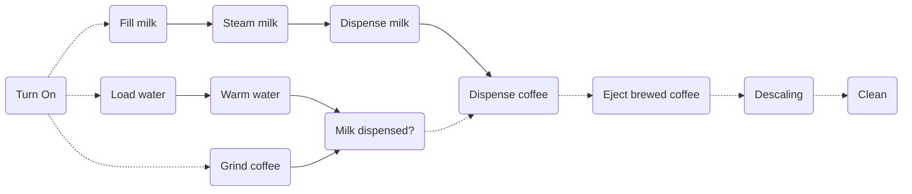

# Cappuccino WF Specs

```mermaid
graph LR

TO(Turn On)
LW(Load water)
WW(Warm water)
GC(Grind coffee)
DC(Dispense coffee)
EB(Eject brewed coffee)
FM(Fill milk)
SM(Steam milk)
DM(Dispense milk)
C(Clean)
D(Descaling)
MD(Milk dispensed?)

TO -.-> LW
LW --> WW
WW --> MD

TO -.-> GC
GC --> MD

DM --> DC
MD -.-> DC

DC -.-> EB
EB -.-> D
D -.-> C

TO -.-> FM
FM --> SM
SM --> DM
```

